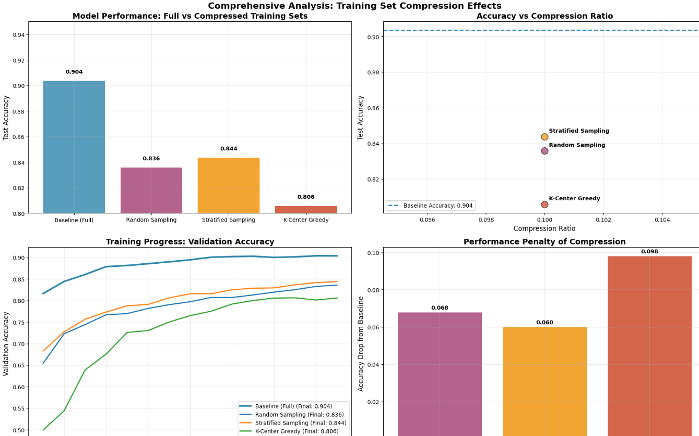
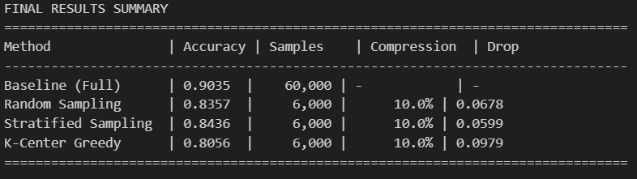
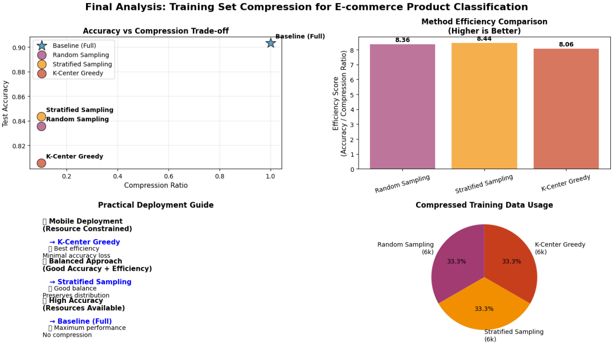

# CAP6415_F25_Measuring-Effects-of-Training-Set-Compression-on-Task-Performance
Vinayak,Neel,Priyank

# E-commerce Product Image Classification – Training Set Compression

This project evaluates how **training set compression** impacts the accuracy of a
CNN classifier for e-commerce product images using the **Fashion-MNIST** dataset.

We simulate a real-world scenario where an e-commerce company wants to deploy a
mobile app that can classify product categories from user-uploaded images, but
has **limited storage and compute** on the device. The goal is to see how much
we can reduce the training data while keeping accuracy high.

## Methods Compared

- **Baseline (Full Dataset)** – 60,000 training images
- **Random Subsampling (10%)**
- **Stratified Sampling (10%)**
- **K-Center Greedy Coreset (10%)**

For each method we:

1. Compress the training set.
2. Train the same CNN architecture.
3. Evaluate on the full test set.
4. Compare accuracy, loss, efficiency, and performance drop.

## Project Structure

- `ecommerce_compression.py` – Full end-to-end script:
  - Data loading and exploration
  - Preprocessing
  - Baseline CNN training
  - Compression methods:
    - Random Subsampling
    - Stratified Sampling
    - K-Center Greedy
  - Training on compressed datasets
  - Comprehensive visualizations
  - Final analysis and recommendations
- `ecommerce_compression.ipynb` *(optional)* – Notebook version of the same logic.
- `requirements.txt` – Python dependencies.
- `.gitignore` – Ignore virtual environment and cache files.


##Results




## How to Run

### 1. Clone the repository

```bash
git clone https://github.com/<your-username>/CAP6415_F25_project-Ecommerce-Compression.git
cd CAP6415_F25_project-Ecommerce-Compression
